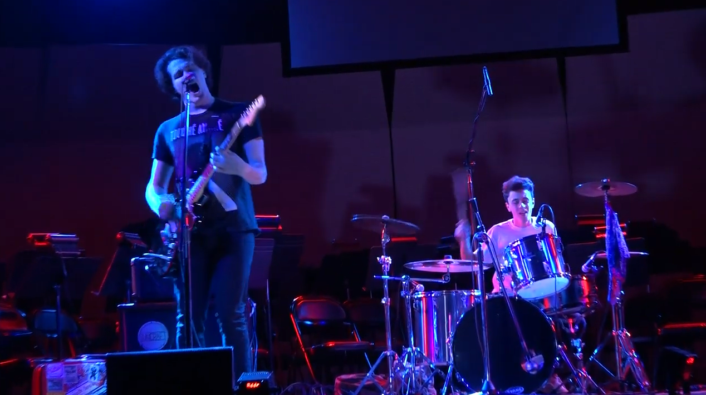

This video for our first single “The More You Know” captures the start of some life long friendships. Some “young adults” getting to know each other and the opportunity to take advantage of our college auditorium for the afternoon. Actually, I believe we were helping two different school projects to completion on this day. Maxine who filmed was a peer in a Television Media program and was tasked with a final project. Jared and Ian were in a theater class and needed some extra credit by running sound in the big empty room. This was the first time Steven ever played bass with us, I think he kept up pretty well. This will probably be the biggest stage we will ever get to play on as a band and I cherish that. Everyone who is in this video is still very much a part of Common Nonsense and the friendships that have grown around it. Though we each are at different points in our life and have moved to different places, the friendships have stayed the same.

<iframe width="560" height="315" src="https://www.youtube.com/embed/seZ9-npviEs" title="YouTube video player" frameborder="0" allow="accelerometer; autoplay; clipboard-write; encrypted-media; gyroscope; picture-in-picture; web-share" allowfullscreen></iframe>

The song started out similar to the way most of our songs get their beginning, a minor chord progression that gets worked out on an acoustic guitar. I was still young and new to writing my own songs when this riff appeared in my head. 17-year-old me was heavily inspired by other emo/post-hardcore bands of the time like Movements, Sorority Noise, and Touche Amore just to name a few. In fact, the chord progression closely resembles that of the song “Protection” by Movements, though they feel completely different as songs. 

I liked the idea of the chorus being a lower-energy point in the song. The structure of a song has always been my favorite part of writing something new. The verses tend to build anticipation for a release and the pre chorus makes the transition feel like there is something about to break free. Then the chorus comes and the energy gives way, making the listener aware of the guitar being strummed and the lyrics being said. Not until the end does all the energy finally let loose, thus making the song feel complete. 

The lyrics are driven from a sad boi emo hour from the basement of my parents’ house. Someone who wasn't afraid to be brutally honest and ready to take the next step in life. Relatable for a person who gets caught in their own head, self-conscious, or feeling unrelatable to the world. Though like most of the lyrics I sing, I rarely write them down. So what makes the final cut may be a loose reflection of the feelings they are trying to portray. 

When the song was recorded into the final version you hear above, the name Common Nonsense had not even been thought of. Steven (our engineer turned bass player) had just finished recording the first Rendered Worthless EP and I was eager to show him a song or two that I had already written. The More You Know was in a complete form lyrically and musically and was an easy choice when given the chance to record just one song that spring. 

The recording process was fun and we took what we learned from recording past projects allowing us to be a bit more creative with this one song. First starting with the basic scratch track (something that gets thrown away for the final mix but is something for the drummer to play along with). Then Rocky, already being an established studio drummer, came in and added the backbone to the song for the first time. Hearing the song take life was a monumental moment for my own confidence in songwriting. Next we would track the guitars. Steven came up with the idea to have stereo amps for a wider guitar tone. An AC15 that was a dry signal (no effects) and Badcat combo with reverb added made up the pair of amps. We used my Fender Marine Layer Reverb pedal for a large ambience on the one amp. We then doubled the guitar on the whole song and flipped the inputs of the two amps. When you hear it all together, on both sides of the mix you have both the dry and wet signals in each ear but with different performances. With different nuances in each performance on guitar the song captures a wide atmosphere. Lastly the bass gets added before going to the vocal booth. 

This was my first time ever standing in a vocal booth when recording vocals for this song. To say I’m not a trained vocalist is an understatement. This was the most difficult part of the process to get right. Being so vulnerable for my first song under my own project was a big deal (I mean my parents were gonna be the only ones who cared to listen anyways). Listening back so many years later I’m still proud of how this song turned out. It still comes up in our live shows (When we did those) and was one of the only songs where I can hear people singing the words back. A great song to start the set with and sometimes an even better ender for a show.